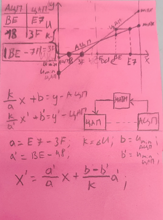
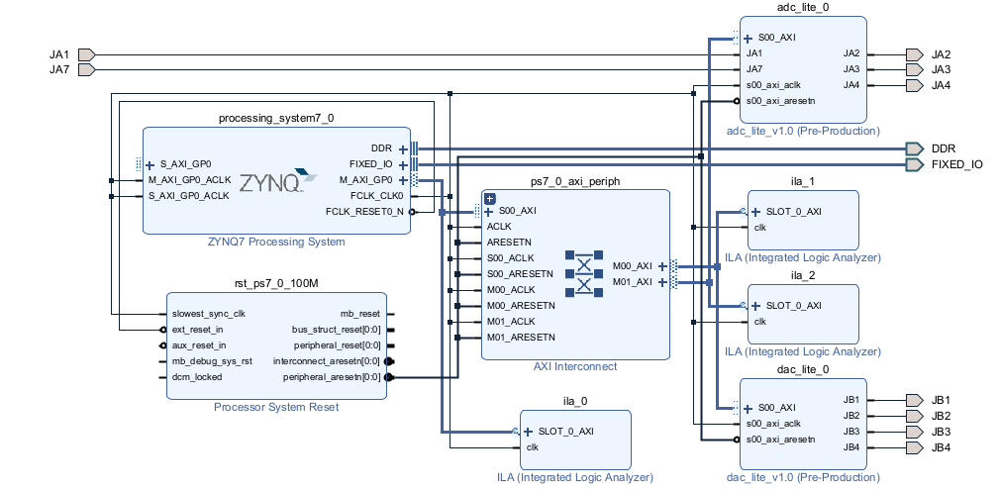

# Description
Vitis calibration with DAC11001 and AD7655 by using simple mathematical transformation and idea.  
  
Сonverting code from ADC to DAC
```
void calibration(){
	int values[] = {0x01F00000, 0x01B00000};
	float voltage[2];
	float offset[2];
	int data[2];
	for(int i=0;	i<2;	i++){
		write_data_control_reg(values[i]);
		xil_printf("Data went: 0x%08X,", values[i]);
		for (int delay = 0; delay < 10000000; delay++);
		data[i] = read_data_in_reg();
		xil_printf(" Result: 0x%08X\n",data[i]);
		voltage[i] = get_voltage(data[i]);
		offset[i] = get_offset(i);
		if (voltage[i] == -1)
			xil_printf("Huge error,data wrong");
	}
	float kx = fabs((values[0]-values[1])/256)/fabs(data[0]-data[1]);
	float bx = ((offset[1]-offset[0])/(voltage[0]-voltage[1]))*((values[0]-values[1])/256);
	xil_printf("Your X = ");
	print_float(kx);
	xil_printf("*x +");
	print_float(bx);
	float step = voltage_step(data[0],data[1]);
	test(kx,bx,step);
}
```
## Block design


>  Use Makefile for future bitstreams